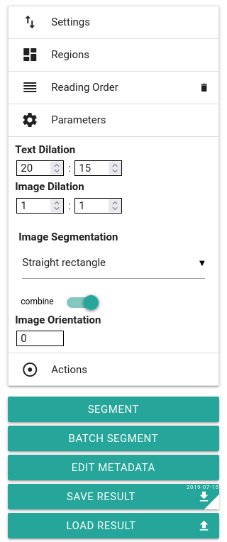

# Ground Truth Production

## Introduction

Ground Truth, the corrected transcription on which the OCR models are trained, is generated in the LAREX tool.

## Page segmentation

If a page doesn't contain any content but has a page segmentation (maybe with garbage line segments), delete it:

Select the segment and click on 'Delete"

## Line segmentation

When training/refining the OCR model, the OCR engine looks at the selected line polygons.
They should contain all relevant text-related pixels of a line and as possibly little noise (parts of other lines, empty space with scan noise etc.).

It's, however, probably not worth spending too much time on refinig the line polygons.

What is important for a satisfactory OCR result is that each separated line is recognized as such.

Oftentimes, you will find double lines:

They have to be split, otherwise the lines will not be OCRed correctly and will be missing in the end result.

Lines can be split ...

1. either by adjusting one polygon to one line and adding a second one, or
2. by using the `Subtract` function: . Cut the line into two.

An any case you will have to add one or two lines to the reading order.

Initials are tricky. Ideally, you consider them as separate lines.

## Transcription guidelines

1. Be as accurate as possible. Information can be taken away by (automatic) normalization, but it cannot be added if needed later on. Distinguish between 'ae' and 'æ', 's' and 'ſ', '&' and 'et' and so on.
2. Use unicode characters in a consistant way.

Important Unicode characters:

| char | Unicode | Windows |
| --- | --- | --- |
| æ | u00e6 | Alt+0230 |
| Æ | u00c6 | Alt+0198 |
| q́ | q + u0301 | Alt+0301 |

## Save results

Currently, writing to file is triggered only by clicking on `Save result` in the LAREX side pane (or `Ctrl` + `S`):

So, when you've done with a page, do remember saving your work.